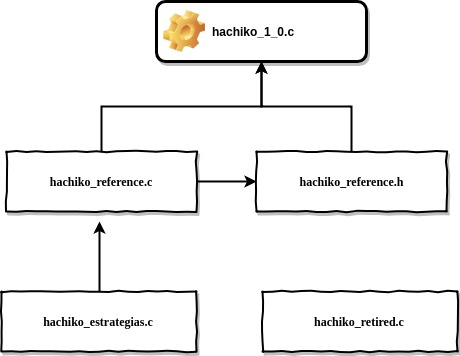
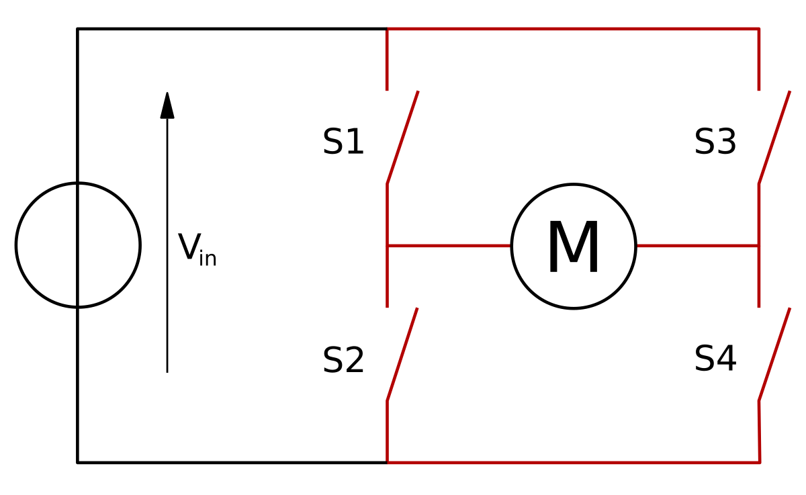

# HachikoFirmware
Repositório para ensinar novos e antigos competidores de Sumô 3kg (Auto) a usar o código usado no robô Hachiko da equipe FEG-Robótica e adaptá-lo para seu próprio robô.

## Sumário

1. [Objetivo](#objetivo)
2. [Hardware](#hardware)
    1. [Placa Hachiko](#placaHachiko)
    2. [Mecânica Hachiko](#mecHachiko)
3. [Software](#software)
    1. [Estrutura de bibliotecas](#bibliotecas)
    2. [Configuração](#configuracao)
        1. [Sentido dos Pinos](#sentidoPinos)
        2. [PWM](#pwm)
        3. [ADC](#adc)
        4. [Diretivas de Compilador](#diretivas)
    3. [Acionamento dos Motores](#acionamentoMotor)
    4. [Leitura de Sensores Analógicos](#leituraSensoresAnalogicos)

#### Objetivo <a name="objetivo"></a>
O principal objetivo deste repostório é capactar colegas programadores a usar este código como inspiração para seus códigos, tanto em placas semelhantes a que eu usei, quanto em placas diferentes como Arduino ou Arm, portanto tento nesta descrição descrever tanto do ponto de vista do hardware que eu estou manipulando para alcançar meus objetivos, bem como também descrever a lógica por trás do código por meio de imagens e explicações textuais. 

<a name="hardware"></a>
#### Hardware 

Esta seção se dedica a explicar o hardware que foi usado neste projeto, uma vez que ele irá definir diversas decisões que foram tomadas ao longo deste projeto. Uma descrição mais precisa pode ser obtida acessando a documentação específica do hardware. Uso este momento também para lembrar que é possível acessar neste [link](https://github.com/silasvergilio/MetalGarurumon-Firmware) o repositório do robô que antecedeu este, muitos aspectos daquele projeto foram usados aqui e corrigidos aqui também, porém a sua formatação é em um arquivo pdf, espero com este repositório criar algo que ajude a criar um guia mais reproduzível. 

<a name="placaHachiko"></a>
##### Placa Hachiko 


Após uma série de melhorias desde a **Placa Lobo**, a placa Hachiko traz mais portas para sensores de distância. Pinos de interrupção externa em dois sensores de linha, mas mantém suas outras qualidades e características já bem conhecidas. Abaixo segue as principais que irão influenciar no nosso código. 

| Característica  | Valor |
| ------------- | ------------- |
| Sensores de distância  | 6  |
| Sensores de Linha  | 4  |
| Sensores de Linha com Interrupção Externa  | 4  |
| Acionamento  | Bluetooth  |
| Tensão de Entrada  | 24V - 36V |

<a name="mecHachiko"></a>
##### Mecânica Hachiko 


Por mais que em geral se veja o programador como alguém num mundo abstrato, para o sumô de robôs é preciso uma boa interdisciplinaridade, o nosso código deve conversar com as caraterísticas físicas do nosso robô, tanto do ponto de vista mecânica quanto do ponto de vista da eletrônica, por mais que o conhecimento necessários nestas áreas não seja profundo, quanto mais profundo melhor, segue abaixo algumas das principais características, seguidas de uma conclusão.

| Característica  | Valor |
| ------------- | ------------- |
| Motores  | Maxon RE40  |
| Velocidade Máxima Teórica | 6m/s  |
| Relação de transmissão de engrenagens  | 4.9 : 1  |
| Dimensões | 196x196x90mm |
| Ângulo da rampa | 18º |

Conclusão. **Este robô é __muito__ rápido**. Todas as ideias aplicadas aqui levam este fato em consideração. 
> Caso isso não fosse verdade, mudaria muito no programa ? 

Não **muito**. Todavia algumas decisões na parte de estratégias mudariam. Mas não vamos colocar a carroça na frente dos bois. Vamos seguir com nossas primeiras linhas de código.

<a name="software"></a>
#### Software

A linguagem de programação usada neste projeto foi a linguagem C, todavia ao se programar PIC é natural que exista diferentes compiladores, um muito comum seria usar o MPLab, todavia para este projeto foi usado o compilador CCS. Ele tem uma linguagem simples de usar que não exige grande conhecimento sobre manipulação de bits e uso de registradores específicos.

<a name="bibliotecas"></a>
##### Estrutura das bibliotecas



A estrutura acima mostra quais os arquivos que compooem o projeto do firmware completo. Abaixo segue a explicação da utilização de cada um destes arquivos.

  1. *hachiko_1_0.c*  Este é o arquivo principal que contém a função main() que será efetivamente utilizado, nele ocorre também a configuração dos *fuses* que irão aparecer mais a frente. Neste arquivo são implementadas as funções de cada Timer como será explicado mais a frente também. 
  
  2. *hachiko_reference.h* Neste arquivo são declaradas todas as funções da biblioteca principal e todas as constantes utilizadas ao longo do programa.
  
  3. *hachiko_reference.c* Este é o arquivo da biblioteca principal, a maioria das funções utilizadas no programa são implementadas aqui.
  
  4. *hachiko_strategies.c* Aqui são implementadas apenas as rotinas de estratégias de busca do robô
  
  5. *hachiko_retired.c* Aqui estão funções que já estão implementadas, todavia não são mais usadas no projeto atual.


<a name="configuracao"></a>
##### Configuração

<a name="sentidoPinos"></a>
##### Sentido dos pinos
Toda a seção de configuração do hardware foi feita em uma única função da biblioteca *hachiko_reference.c*, a primeira parte que entraremos em detalhe é o *set_tris*, essa é uma função que define o sentido de cada porta, ou seja, se determinado pino de cada porta é **entrada** ou **saída**, cabe ao programador em conjunto com o seu grupo da eletrônica analisar qual a função de cada porta da sua placa. 

Exemplos de dispositivos de **entrada**:

1. Sensor de Distância
2. Sensor de Linha
3. Sensores Internos (sensor de sobrecorrente)
4. Sensores em geral

Exemplos de dispositivos de **saída**:

1. Sinal PWM
2. LED
3. Controle dos Motores

Para o caso do o *set_tris_x* ele recebe como argumento um número, em que cada bit dele representa um pino de determinada porta X. A maneira indicada aqui para fazer tal é escrever este número já na forma binária para facilitar sua vida usando a notação *0b* antes do número, como indicado abaixo. Onde 1 indica *input* enquanto que 0 indica *output*.
 

```C
   set_tris_a(0b11111111);
   set_tris_b(0b00000000);
   set_tris_c(0b10111111);
   set_tris_d(0b00000000);
   set_tris_e(0b1111);
```

A decisão dos números foi feita baseada no esquemático da placa acima. Há uma grande chance do seu projeto usar um Arduino, neste caso bastaria usar o comando *pinMode* para definir o sentido, como por exemplo:

```C
pinMode(pinoDesejado,INPUT); //Para um dispositivo de entrada
pinMode(pinoDesejado2,OUTPUT); //Para um dispositivo de saída
```

<a name="pwm"></a>
##### PWM

Existem 3 principais maneiras de gerar um sinal PWM usando o PIC18F4431. Usando o canal CCP (capture, compare, PWM), método que nunca foi usado por mim. Criando a onda "manualmente" a partir das interrupções do timer, fazendo os devidos cálculos, ou por fim, o método que usamos chamado "Power PWM", as principais vantagens são as seguintes:

1. Fácil utilização
2. Suporta frequências mais altas (faixa acima de 50kHz)
3. Permite diversos modos de utilização

Abaixo seguem as linhas necessárias para configurar o PWM, logo em seguida vamos explicar em mais detalhes como compreender e configurar para a sua necessidade. 

```C
//Configuracao dos modulos PWM do PIC18F4431

   setup_power_pwm_pins(PWM_BOTH_ON,PWM_BOTH_ON,PWM_BOTH_ON,PWM_BOTH_ON); // Configura os 4 módulos PWM.
   setup_power_pwm(PWM_FREE_RUN, 1, 0, POWER_PWM_PERIOD, 0, 1,30);
```
No Pic18F4431 existem 4 canais PWM, eles trabalham em dupla, na primeira linha decidimos qual será a relação entre cada um destes canais (duplas). Neste caso definimos todos como "PWM_BOTH_ON", indicando que eles funcionaram de maneira idêntica entre si e de modo não complementar.


A segunda linha indica como irá funcionar a onda do PWM em si, vamos compreender cada um dos argumentos.

1. O primeiro valor 'PWM_FREE_RUN', indica o modo de contagem em que o PWM irá se basear, o modo FREE RUN é o mais aconselhado para mover motores DC
2. O valor **1** indica o postscale da frequência usada para o PWM, com o valor unitário a frequência não será dividida, e para todos os cálculos vamos usar o valor de 5Mhz, que seria 20Mhz da placa dividido por 4 (divisão padrão realizada com toda frequência que entra do cristal no PIC).
3. **0** na terceira posição indica qual o valor inicial da contagem do contador para o PWM, este e outros valores ajudam a manipular melhor a frequência desejada no PWM
4. **POWER PWM PERIOD** é uma constante definida no programa que é o valor que representa o período da onda PWM, dentro deste projeto e outros é a maneira convencional de ajustar a frequência desejada, todavia não o único. Após estudos realizados pela equipe, que podem ser vistos **aqui[TODO LINK PARA CIC 2018]**, a frequência de 50kHz foi adotada pela melhor eficiência do motor Maxon.
5. Este valor **0** indica que não haverá tratamento de nenhum evento especial ligado ao PWM.
6. O 1 indica o postscale, mais uma opção para controle da frequência que desejamos utilizar.
7. 30 é o valor para o *deadtime* do PWM, é um valor pequeno apenas para segurança da eletrônica de potência no chaveamento.

Notamos a partir desta configuração que o principal valor a ser controlado neste caso é o valor do período do PWM, este valor é dado em ciclos de instrução do PIC. Exemplo:

Para um cristal de 20Mhz, no PIC entra na realidade 4MHz, 1/4000000 = 0.25us  , este será o tempo de cada instrução. Usando este valor para entendermos o período, caso tenhamos um valor de **POWER PWM PERIOD** de 500, isso representa um período de 0.125ms. A fim de calcularmos a frequência, basta usarmos a equação f = 1/T, onde *f* é a frequência, e *T* é o período que apresentamos anteriormente. Portanto para o exemplo aqui dado a frequência seria de 8kHz. 

Para o caso do **Arduino** não há uma maneira de trabalhar com maiores frequência,todavia é preciso utilizar as portas adequadas da placa em questão. O Arduino trabalha em geral com frequência de 1kHz.

<a name="adc"></a>
##### Conversor Analógico-Digital (ADC)

O conversor analógico-digital tem por função transformar um valor de tensão analógica (entre 0V e 5V) em um valor digital que vai de 0 a 1023, é a única maneira que temos de ler o valor de um grande grupo de sensores, incluindo alguns modelos de sensores que nos ajudarão a enxergar o adversário e a linha branca do *dohyo*. A sua configuração é simples, sua utilização é menos simples, mas trataremos disto mais a frente. O código abaixo configura todas as portas que podem, como conversores.

> Observação: Existem 8 portas que podem funcionar como conversores A/D, todavia o PIC na verdade tem apenas **um** conversor A/D, para usar mais do que uma porta para conversão o PIC possui um multiplexador, mais sobre isso será explicado na função da leitura do conversor A/D mais a frente.

```C
   setup_adc_ports(ALL_ANALOG); 
   setup_adc(ADC_CLOCK_INTERNAL); 
```

A primeira linha do excerto de código acima define que todas as portas possíveis serão analógicas, para  configurar apenas algumas portas como ADC é preciso consultar a documentação específica do CCS. A segunda linha configura o ADC para usar o clock que entra no PIC (no caso da nossa placa será 4Mhz) para realizar a conversão. O processo de conversão é sensível ao tempo, por isso esta informação é importante, alguns circuitos usam clocks externos para melhorar a velocidade de conversão. No nosso caso **ler um pino digital leva muito menos tempo do que realizar uma conversão analógico-digital**.


<a name="diretivas"></a>
##### Diretivas de Compilador

Algumas das configurações que realizamos não acontecem dentro da funço *config()*, algumas delas ocorrem no arquivo principal, no formato que chamamos de *diretivas de compilador*, são comandos que servem apenas para o compilador e não para a nossa sequência de códigos lógicos, é como uma instrução que não será executada pelo PIC em si, e sim pelo compilador a fim de garantir algumas configurações no funcionamento mais básico do Hardware. A primeira destas configurações se relaciona com o último tópico que falamos, de ADC. Toda diretiva é caracterizada por começar por *#*. 

```C
#device adc=10 
```
A diretiva acima garante que o nosso conversor terá a resolução de 10bits, ou seja, um valor de tensão de 0V a 5V irá gerar um número de 0 - 1023. 

A próxima diretiva se refere a configurações de funcionamentos específicos do PIC, explicaremos uma de cada vez

```C
#fuses HS, NOWDT, NOPROTECT, NOBROWNOUT, NOPUT, NOLVP 
```

1. HS - Significa que estamos usando um cristal de alta velocidade (no caso 20Mhz)
2. NOWDTH - Não desejamos nos usar do WatchDog Timer, que impede que o programa "trave" dentro de loops infinitos ou algo assim. Nosso robô depende de um loop infinitos
3. NOPROTECT - O código não é protegido,portanto é possível acessar ele a partir do microcontrolador
4. NOLVP - Desabilita programação em baixa tensão.

Embora acima tenhamos definido que vamos usar um cristal de alta velocidade, porém precisamos usar outra diretiva para definir qual o valor exato do nosso cristal.

```C
#use delay(clock=20000000)
```
Existem mais algumas configurações que serão trabalhadas, como a porta Serial e os timers, todavia eles serão tratados em suas respectivas sessões a fim de alinhar sua configuração com sua utilização. 


<a name="acionamentoMotor"></a>
##### Acionamento de Motores

Na placa deste robô, e também da maioria dos robôs da competição, os motores são acionados por um tipo de eletrônica chamada *Ponte H*, o seu funcionamento pode ser detalhadamente descrito na documentação da equipe eletrônica, todavia o funcionamento do nosso circuito específico merece um espaço aqui. Abaixo segue uma imagem que usaremos para descrever de maneira conceitual.



A fim de acionar um motor num determinado sentido é preciso fechar a chave S1 e S4, e para outro sentido, usar a chave S2 e S3 gira o motor em outro sentido. No nosso circuito cada par de chaves é ligado a um canal diferente do PWM (aqueles programados em nossa seção de configuração), de maneira que podemos abrir e fechar elas usando uma onde PWM, controlando assim não só seu sentido como também sua velocidade ligando e desligando a chave dentro de um ciclo de trabalho estipulado. 

Existem diferentes maneiras de escrever as funções que irão movimentar o seu robô, abaixo segue algumas opções, todavia explicarei com mais detalhes a que foi adotada aqui.

1. Criar uma função que recebe 4 argumentos. 1 deles indicando qual motor deseja ser acionado, outro indicando o sentido, outros dois indicando a velocidade.
2. Criar uma função para cada movimento que o robô pode fazer, ir para frente, ira para trás, virar para esquerda, virar para a direita. Que recebe apenas um argumento, sua velocidade. 
3. Nosso caso. Criar uma função para cada motor, onde cada função recebe 2 argumentos, um indicando o sentido, o outro indicando a velocidade do motor em %.

Abaixo segue o código contido na função *motor_1(char sentido, int velocidade)*


```C
void motor_1(int duty_cycle, char sentido)
{
   if(sentido == 'b')
   {
      set_power_pwm0_duty((int16)((POWER_PWM_PERIOD *4) * (duty_cycle*0.01)));
      set_power_pwm2_duty((int16)(0));
   }

   if(sentido == 'f')
   {
      set_power_pwm0_duty((int16)(0));
      set_power_pwm2_duty((int16)((POWER_PWM_PERIOD *4) * (duty_cycle*0.01)));
      
   }
}
```
O comando que precisamos prestar atenção é o `set_power_pwm0_duty()`. Primeiramente podemos observar que na própria chamada da função já indicamos qual dos canais do PWM que queremos controlar. Dentro desta função vai um número que representa qual a porcentagem de ciclo de trabalho iremos usar. Todavia este valor não é passado diretamente como uma porcentagem. **O valor máximo desta função é 4 vezes o valor do período do sinal PWM**, o valor do período foi definido durante a configuração. A partir desta informação podemos concluir que quanto menor a frequência, maior será quantidade de diferentes valores que poderemos inserir lá, portanto quanto maior a frequência do PWM, menor sua resolução (considerando que estamos controlando a frequência do PWM usando apenas o valor do seu período). 

Quando desenvolvi esta função não pretendia trabalhar com uma grande resolução e valores de 0 a 100 já seriam o suficiente. Portanto como argumento é passada a conta 4 x Período do PWM x Porcentagem. A fim de facilitar a manutenção do código.

Para um código em Arduino, bastaria utilizar o comando

```C
analogWrite(pinoPWM,valorPWM);
```

Lembrando que há pinos compatíveis com com o sinal PWM que variam de acordo com o modelo, o valor do PWM vai de 0 a 255.

<a name="leituraSensoresAnalogicos"></a>
##### Leitura de Sensores Analógicos

A maioria dos sensores utilizados neste projeto estão conectados em portas analógicas do PIC. Primeira coisa importante de salientar é que os pinos do PIC habilitados a uma leitura analógica **não precisam obrigatoriamente** fazer leitura analógica, eles podem fazer leitura digital, basta não configurá-los como uma leitura analógica. O processo de uma leitura analógica é **mais lento que a leitura digital**. Todo o processo de leitura ocorre em uma função preparada para cumprir as devidas tarefas:

1. Preparar um determinado pino para fazer uma leitura
2. Verificar se o valor lido foi menor ou maior que um determinado *threshold* 
3. Armazenar a informaço acima em um determinado bit de uma determinada palavra.

Dadas estas informações, criou-se a função abaixo.

```C
int8 leitura_adc(int16 threshold, int canal, int8 resposta_leitura, int bit)
{

   switch(canal) //switch para preparar o canal desejado para a conversão A/D
   {
      case 0: set_adc_channel(0); break;
      case 1: set_adc_channel(1); break;
      case 2: set_adc_channel(2); break;
      case 3: set_adc_channel(3); break;
      case 4: set_adc_channel(4); break;
      case 5: set_adc_channel(5); break;
      case 6: set_adc_channel(6); break;
      case 7: set_adc_channel(7); break;
      case 8: set_adc_channel(8); break;
      default: break;
   }

   delay_us(10);            //delay de 10 us importante ser um valor pequeno
   leitura = read_adc();    //Realiza a leitura do canal analogico-digital

   if(debugging_linha)
   {
   if(canal == canal_sensor_linha_1)  printf("*P%Lu*",leitura);
   else if(canal == canal_sensor_linha_2) printf("*G%Lu*",leitura);
   else if(canal == canal_sensor_linha_3) printf("*T%Lu*", leitura);
   else if(canal == canal_sensor_linha_4) printf("*K%Lu*", leitura);
   }

   if (leitura > threshold) bit_clear(resposta_leitura,bit); 
   else bit_set(resposta_leitura,bit); 

   return resposta_leitura; //devolve a variavel com seus bits alterados
}
```
Primeiramente de acordo com o canal indicado (cada porta do PIC disponível para conversão A/D representa um canal), o PIC preparada aquele canal (ou seja, direciona o multiplexador para aquele pino). Usando o canal ```C set_adc_channel(canal) ```


