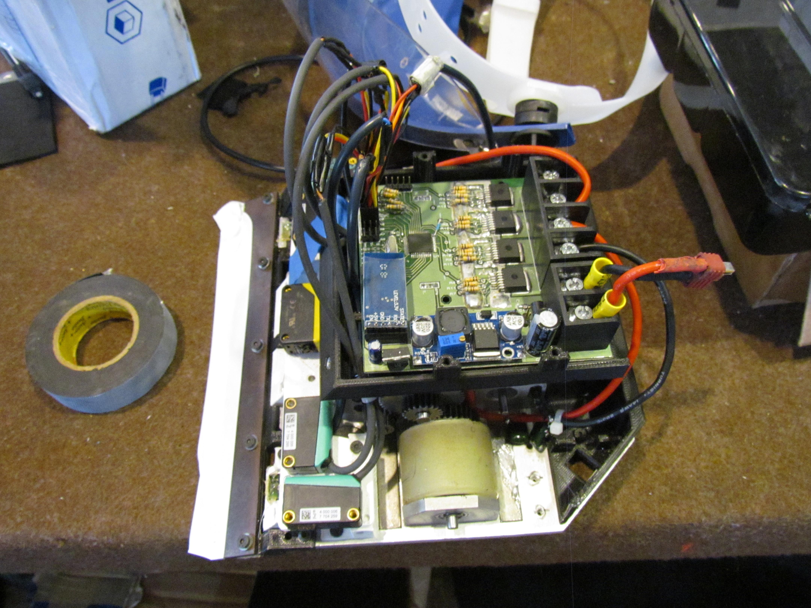
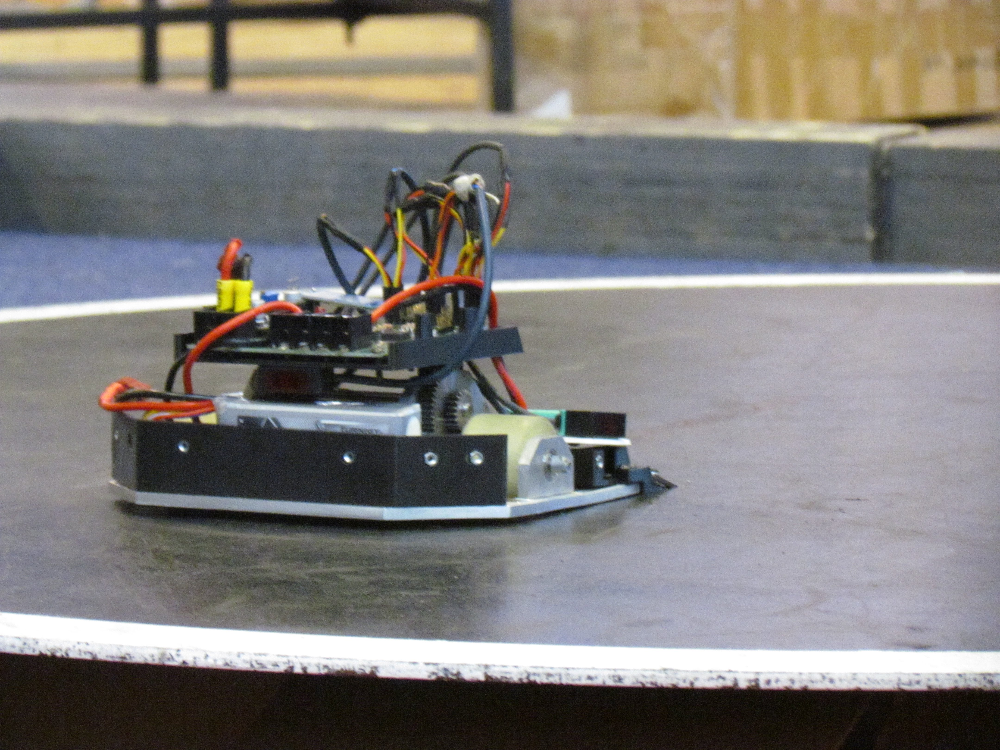

# HachikoFirmware
Repositório para ensinar novos e antigos competidores de Sumô 3kg (Auto) a usar o código usado no robô Hachiko da equipe FEG-Robótica e adaptá-lo para seu próprio robô.

## Sumário

1. [Objetivo](#objetivo)
2. [Hardware](#hardware)
    1. [Placa Hachiko](#placaHachiko)
    2. [Mecânica Hachiko](#mecHachiko)

#### Objetivo 
O principal objetivo deste repostório é capactar colegas programadores a usar este código como inspiração para seus códigos, tanto em placas semelhantes a que eu usei, quanto em placas diferentes como Arduino ou Arm, portanto tento nesta descrição descrever tanto do ponto de vista do hardware que eu estou manipulando para alcançar meus objetivos, bem como também descrever a lógica por trás do código por meio de imagens e explicações textuais. 

#### Hardware 

Esta seção se dedica a explicar o hardware que foi usado neste projeto, uma vez que ele irá definir diversas decisões que foram tomadas ao longo deste projeto. Uma descrição mais precisa pode ser obtida acessando a documentação específica do hardware. Uso este momento também para lembrar que é possível acessar neste [link](https://github.com/silasvergilio/MetalGarurumon-Firmware) o repositório do robô que antecedeu este, muitos aspectos daquele projeto foram usados aqui e corrigidos aqui também, porém a sua formatação é em um arquivo pdf, espero com este repositório criar algo que ajude a criar um guia mais reproduzível. 

##### Placa Hachiko 

Após uma série de melhorias desde a **Placa Lobo**, a placa Hachiko traz mais portas para sensores de distância. Pinos de interrupção externa em dois sensores de linha, mas mantém suas outras qualidades e características já bem conhecidas. Abaixo segue as principais que irão influenciar no nosso código. 

| Característica  | Valor |
| ------------- | ------------- |
| Sensores de distância  | 6  |
| Sensores de Linha  | 4  |
| Sensores de Linha com Interrupção Externa  | 4  |
| Acionamento  | Bluetooth  |
| Tensão de Entrada  | 24V - 36V |

##### Mecânica Hachiko 

Por mais que em geral se veja o programador como alguém num mundo abstrato, para o sumô de robôs é preciso uma boa interdisciplinaridade, o nosso código deve conversar com as caraterísticas físicas do nosso robô, tanto do ponto de vista mecânica quanto do ponto de vista da eletrônica, por mais que o conhecimento necessários nestas áreas não seja profundo, quanto mais profundo melhor, segue abaixo algumas das principais características, seguidas de uma conclusão.

| Característica  | Valor |
| ------------- | ------------- |
| Motores  | Maxon RE40  |
| Velocidade Máxima Teórica | 6m/s  |
| Relação de transmissão de engrenagens  | 4.9 : 1  |
| Dimensões | 196x196x90mm |
| Ângulo da rampa | 18º |

Conclusão. **Este robô é __muito__ rápido**. Todas as ideias aplicadas aqui levam este fato em consideração. 
> Caso isso não fosse verdade, mudaria muito no programa ? 

Não **muito**. Todavia algumas decises na parte de estratégias mudariam. Mas não vamos colocar a carroça na frente dos bois. Vamos seguir com nossas primeiras linhas de código.

